# MarkdownKeeper Architecture

A technical overview of MarkdownKeeper's components, data flow, and design decisions.

---

## Table of Contents

- [System Overview](#system-overview)
- [Component Map](#component-map)
- [Data Ingestion Pipeline](#data-ingestion-pipeline)
- [Database Schema](#database-schema)
- [Search Architecture](#search-architecture)
  - [Hybrid Scoring](#hybrid-scoring)
  - [Embedding Strategy](#embedding-strategy)
  - [Query Cache](#query-cache)
- [File Watcher Subsystem](#file-watcher-subsystem)
  - [Event Queue State Machine](#event-queue-state-machine)
  - [Polling vs Watchdog](#polling-vs-watchdog)
- [HTTP API](#http-api)
- [Daemon and Process Management](#daemon-and-process-management)
- [Configuration System](#configuration-system)
- [Module Dependency Graph](#module-dependency-graph)
- [Key Design Decisions](#key-design-decisions)

---

## System Overview

MarkdownKeeper is a persistent indexing service with three concurrent subsystems:

1. **File Watcher** — monitors directories and queues indexing events into SQLite
2. **Indexer** — drains the event queue, parsing markdown and computing embeddings
3. **API Server** — responds to JSON-RPC queries against the indexed data

All three write to a single SQLite database. The watcher and API server run as separate
system processes (daemons or systemd services); the indexer runs inline as the watcher
drains its own event queue.

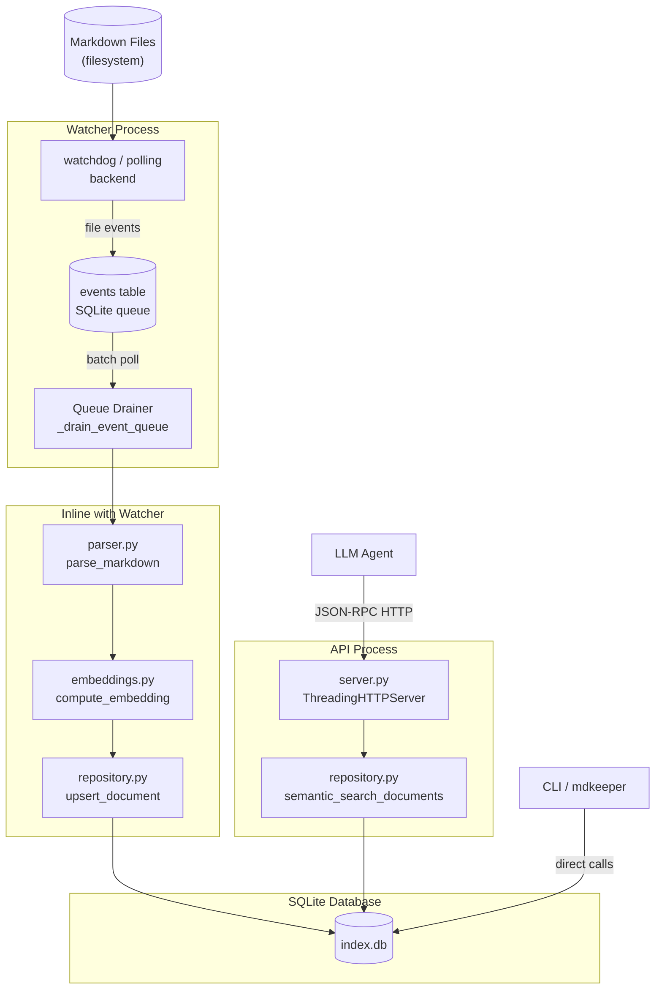

---

## Component Map

| Module | Path | Role |
|---|---|---|
| `cli/main.py` | Entry point | Argparse dispatcher; all CLI subcommands |
| `config.py` | Config | TOML loading; `AppConfig` dataclass tree |
| `processor/parser.py` | Parsing | Extracts structure from raw markdown |
| `metadata/manager.py` | Metadata | Frontmatter schema enforcement and concept extraction |
| `metadata/summarizer.py` | Metadata | Summary generation from parsed content |
| `storage/schema.py` | Storage | Schema init and additive migrations |
| `storage/repository.py` | Storage | All database reads and writes |
| `query/embeddings.py` | Query | Two-tier embedding computation |
| `query/faiss_index.py` | Query | Optional FAISS vector index (future search acceleration) |
| `watcher/service.py` | Watcher | Polling and watchdog backends; event queue drain |
| `links/validator.py` | Links | Internal path and external HTTP link validation |
| `indexer/generator.py` | Indexer | Static markdown index file generation |
| `api/server.py` | API | JSON-RPC HTTP server |
| `daemon.py` | Daemon | PID-file-based background process management |
| `service.py` | Ops | Systemd unit file generation |

---

## Data Ingestion Pipeline

When a markdown file changes, data flows through these stages:

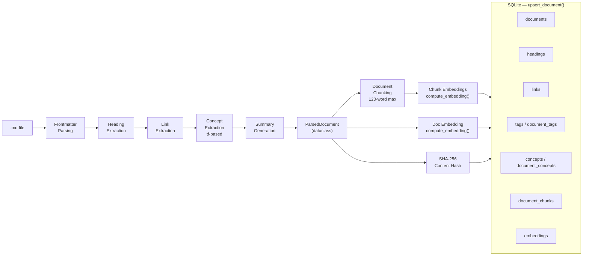

The `upsert_document()` function in `repository.py` owns the entire write path. Before
inserting new child rows (headings, links, tags, concepts, chunks, embeddings), it
cascades-deletes all existing child rows for the document. This keeps the schema
consistent without complex diff logic: every upsert is a full replacement.

Content hash detection happens at the CLI layer (`scan-file`) — but the repository
itself does not skip unchanged documents. The hash is stored and can be used by callers
to skip re-parsing files whose content hasn't changed.

---

## Database Schema

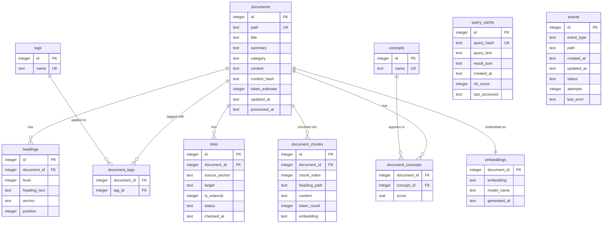

### Schema migration strategy

`initialize_database()` in `schema.py` runs on every startup. It uses
`CREATE TABLE IF NOT EXISTS` for base table creation, then applies additive
`ALTER TABLE` migrations using `PRAGMA table_info()` introspection. This means:

- New deployments get the full current schema
- Existing databases get only the missing columns added
- No destructive schema changes are made in the `v1` line
- `PRAGMA foreign_keys = ON` is set per connection to enforce cascade deletes

---

## Search Architecture

### Hybrid Scoring

The `semantic_search_documents()` function assembles a score for each candidate
document from five independent signals:

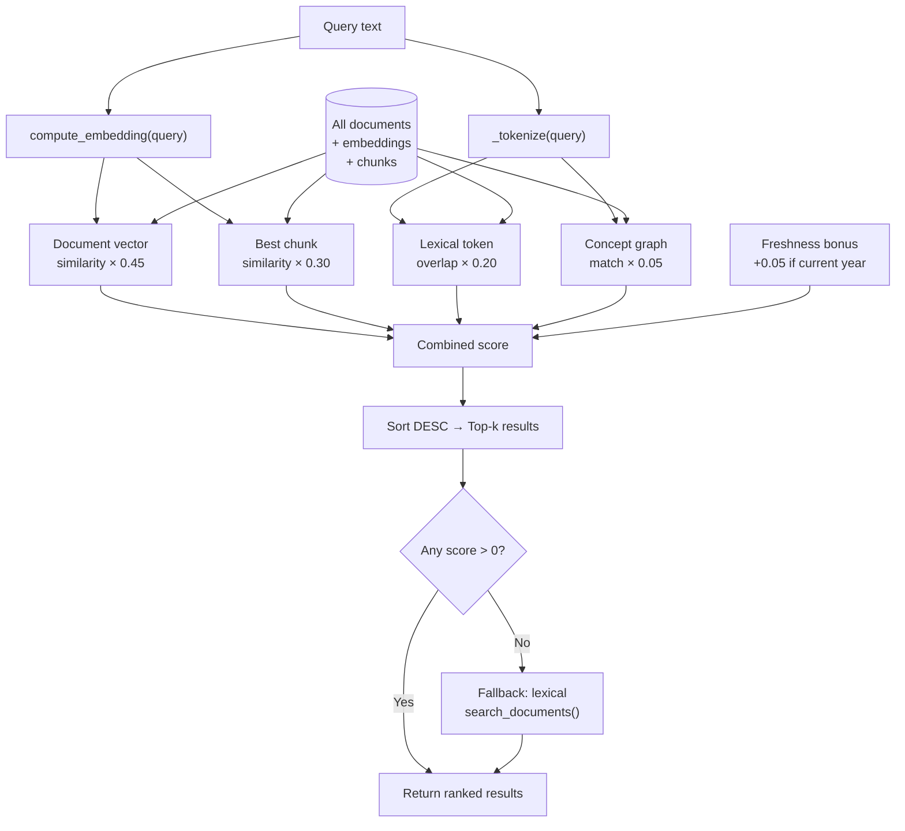

**Signal details:**

| Signal | Formula | Range |
|---|---|---|
| Document vector | `cosine_similarity(query_vec, doc_vec)` | 0.0–1.0 |
| Chunk vector | `max(cosine_similarity(query_vec, chunk_vec) for all chunks)` | 0.0–1.0 |
| Lexical overlap | `len(query_tokens ∩ doc_tokens) / len(query_tokens)` | 0.0–1.0 |
| Concept match | `1.0 if any(qt in doc_concepts) else 0.0` | 0.0 or 1.0 |
| Freshness bonus | `0.05 if doc.updated_at.year == current_year else 0.0` | 0.0 or 0.05 |

The weighted sum is computed in Python (not SQL) over all documents that have embeddings,
scanning the `embeddings` and `document_chunks` tables in memory.

### Embedding Strategy

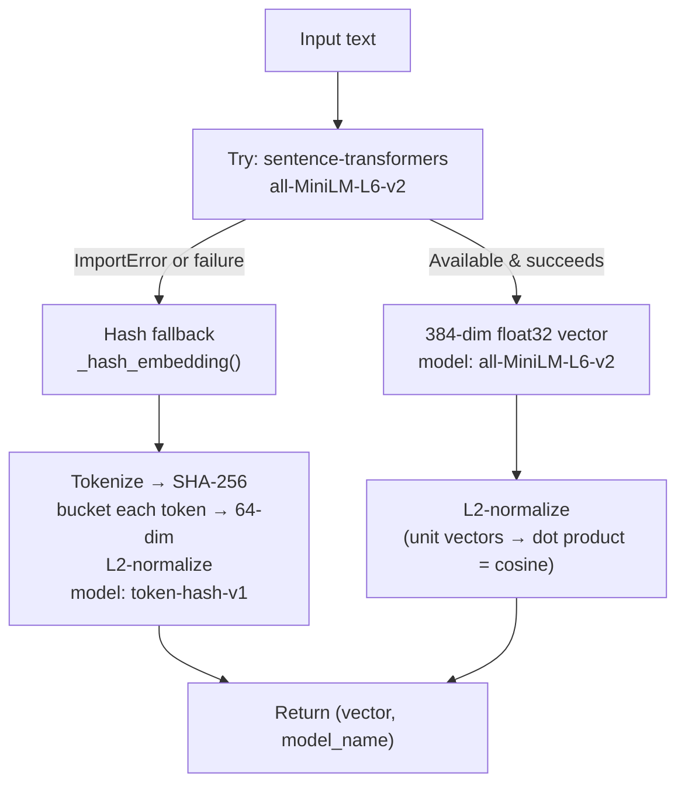

Callers always receive both the vector and the `model_name` string. This lets the
repository record which model produced each embedding in the `embeddings.model_name`
column, and lets operators know when hash-fallback vectors are in use (via
`embeddings-status --format json` → `model_available`).

The hash fallback is deterministic, so test suites can run without any ML dependencies
and still produce consistent vectors for correctness testing.

**FAISS index** (`query/faiss_index.py`): An `IndexFlatIP` (inner product on L2-normalized
vectors = cosine similarity) wraps the document-level embeddings. It is rebuilt during
`embeddings-generate` and saved alongside the database as `faiss.index`. It is not
yet integrated into the main search hot path — the current search scans the embeddings
table directly. It is designed as a future drop-in acceleration layer for large corpora.

### Query Cache

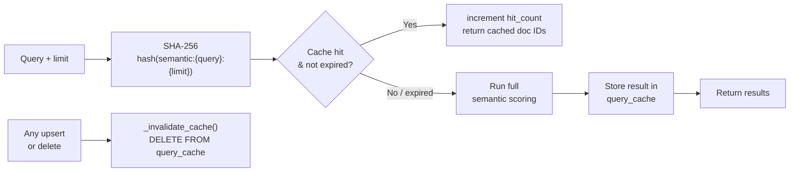

The cache uses a **write-through invalidation** strategy: every document write clears
the entire cache table. This is intentionally blunt — it avoids tracking which document
IDs appear in which cached result sets. The trade-off is that write-heavy workloads see
lower cache hit rates. TTL (default: 1 hour) provides a secondary expiry for dormant
entries.

---

## File Watcher Subsystem

### Event Queue State Machine

All file events — from both polling and watchdog backends — are written to the `events`
SQLite table before processing. This makes the queue durable: events survive process
restarts.

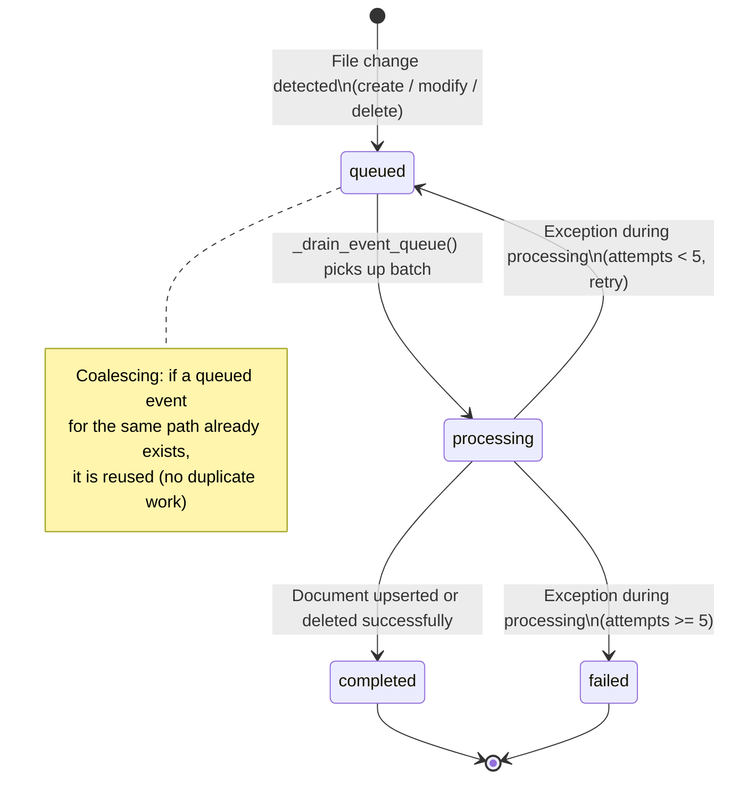

Event coalescing prevents redundant work when a file is saved multiple times in rapid
succession (e.g., editor auto-save on every keystroke). The drainer processes events in
FIFO batches of 256.

### Polling vs Watchdog

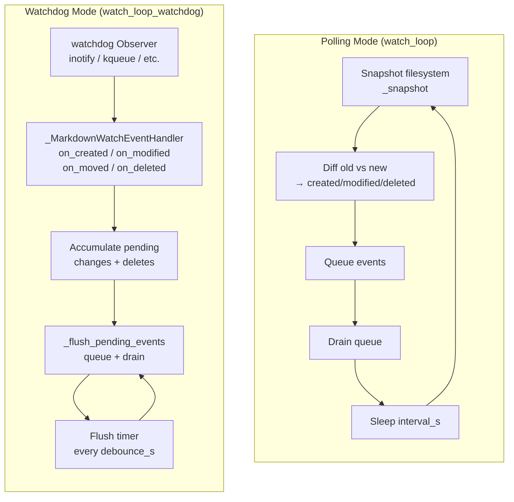

| Characteristic | Polling | Watchdog |
|---|---|---|
| CPU usage | Proportional to directory size | Near-zero when idle |
| Latency | 1 polling cycle (default 1s) | ~250ms (debounce flush) |
| Reliability on network filesystems | High | Low (inotify may miss events) |
| Required dependency | stdlib only | `watchdog` library (always installed) |
| Production recommendation | Fallback only | Default |

Both backends write to the same SQLite event queue and call the same `_drain_event_queue()`
function, so they have identical processing semantics.

---

## HTTP API

The API server is `ThreadingHTTPServer` (stdlib) — no framework dependency. Each
request is handled in its own thread.

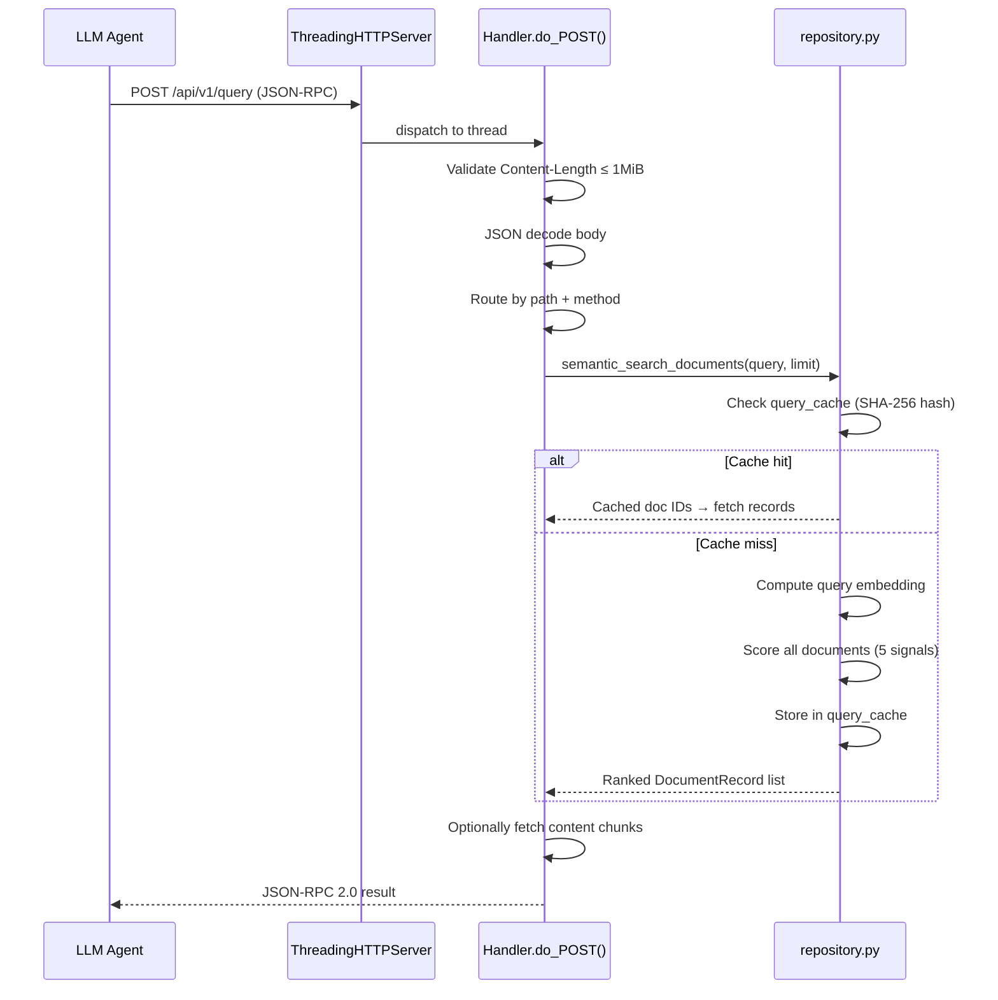

Request routing is by exact path match and `method` field:

| Path | Method | Repository call |
|---|---|---|
| `GET /health` | — | (none) |
| `POST /api/v1/query` | `semantic_query` | `semantic_search_documents()` |
| `POST /api/v1/get_doc` | `get_document` | `get_document()` |
| `POST /api/v1/find_concept` | `find_by_concept` | `find_documents_by_concept()` |

The API server always uses semantic search — there is no `search_mode` parameter on
the API. Use the CLI `query --search-mode lexical` for lexical-only search.

**Safety caps:** `max_results` is clamped to 100; `max_tokens` is clamped to 10,000.
These prevent single requests from scanning and serializing the entire corpus.

---

## Daemon and Process Management

`daemon.py` manages background processes via PID files. The full lifecycle:

```mermaid
flowchart TD
    START["daemon-start watch|api"] --> CHECK{PID file exists\n& process running?}
    CHECK -->|Yes| EXIST[Return existing PID\n(idempotent)]
    CHECK -->|No| SPAWN["subprocess.Popen(\n  command,\n  start_new_session=True,\n  stdout=DEVNULL\n)"]
    SPAWN --> WRITE[Write PID to file]
    WRITE --> DONE[Return new PID]

    STOP["daemon-stop watch|api"] --> READ[Read PID file]
    READ --> TERM[Send SIGTERM]
    TERM --> WAIT{Process exited\nwithin 5s?}
    WAIT -->|Yes| CLEAN[Delete PID file]
    WAIT -->|No| KILL[Send SIGKILL\nDelete PID file]

    RELOAD["daemon-reload watch|api"] --> READR[Read PID file]
    READR --> HUP[Send SIGHUP\n→ config reload]
```

The `start_new_session=True` flag detaches the child from the parent's process group,
so the daemon survives when the launching shell or CLI invocation exits.

The watcher and API services handle SIGHUP by calling the `daemon-reload` subcommand
(via `ExecReload=` in the systemd unit), which re-reads the TOML config without
restarting the process.

---

## Configuration System

`config.py` uses a tree of `@dataclass(slots=True)` objects:

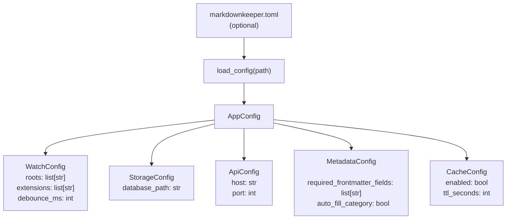

If the TOML file does not exist, `load_config()` returns a default `AppConfig()` with
no error. Fields present in the TOML override defaults; absent fields keep defaults.
This means a minimal `markdownkeeper.toml` need only contain the keys that differ from
defaults.

The database path resolution chain used by every CLI command:

```
--db-path CLI flag
    └─> storage.database_path in config file
            └─> ".markdownkeeper/index.db" (hardcoded default)
```

---

## Module Dependency Graph

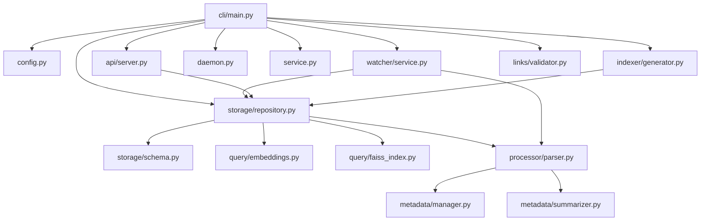

All production state lives in one SQLite file. The `repository.py` module is the sole
owner of database writes — no other module writes to the database directly (except
`links/validator.py` for link status updates and `watcher/service.py` for event queue
management).

---

## Key Design Decisions

### SQLite as the only runtime dependency

Using SQLite means zero infrastructure — no Redis, no PostgreSQL, no message broker.
The database file is portable and directly inspectable with standard tools. The event
queue, query cache, and document index all live in the same file, enabling atomic
cross-table operations.

### Two-tier embeddings for testability

Tests run without any ML libraries installed. The hash-based fallback produces
deterministic 64-dim vectors so unit tests can exercise the full semantic search path
without a GPU or model download. Production deployments install `[embeddings]` and get
384-dim sentence-transformers vectors with substantially higher recall.

### Slots everywhere

All dataclasses use `slots=True`. This prevents accidental attribute assignment (an
early-catch for typos), slightly reduces memory overhead, and makes field access
marginally faster. It is a consistent convention across the codebase rather than a
performance optimization.

### Blunt cache invalidation on writes

Invalidating the entire `query_cache` table on every document write is simpler than
tracking which cached result sets reference which document IDs. The trade-off: a single
document change clears results for unrelated queries. In practice this is acceptable
because the watcher processes changes in batches — a burst of file changes triggers
one cache clear, not N.

### Event queue over direct invocation

The watcher does not call `upsert_document()` directly. Instead it writes an event to
SQLite first, then drains the queue. This makes the indexing path durable: if the
watcher process is killed mid-batch, queued events survive and are reprocessed on
restart. It also enables retry logic (up to 5 attempts) for transient I/O failures.

### ThreadingHTTPServer with no framework

Using stdlib `ThreadingHTTPServer` keeps the API server free of framework dependencies
(no Flask, FastAPI, aiohttp). Each request gets its own thread; SQLite handles
concurrent reads safely. The request limit (1 MiB body) and safety caps on
`max_results` and `max_tokens` are the primary abuse-prevention mechanisms.
